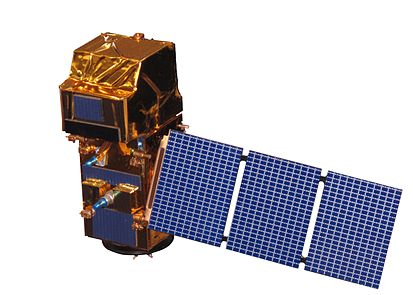
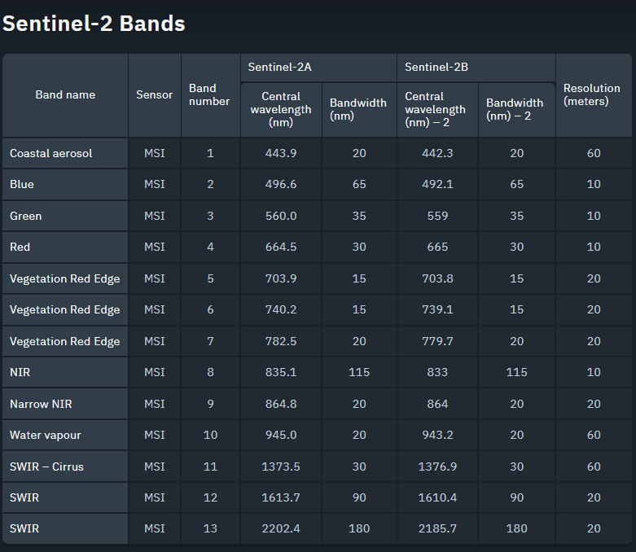
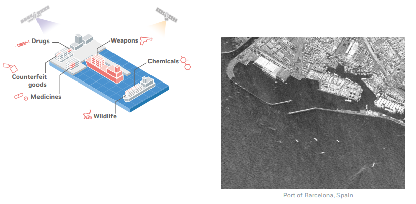
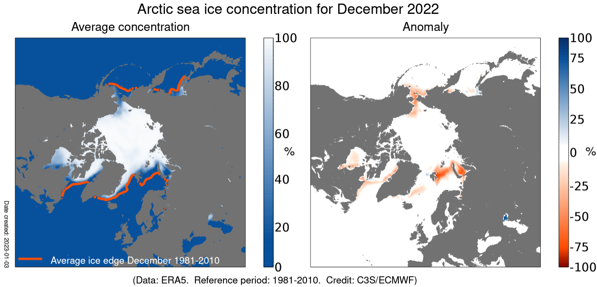
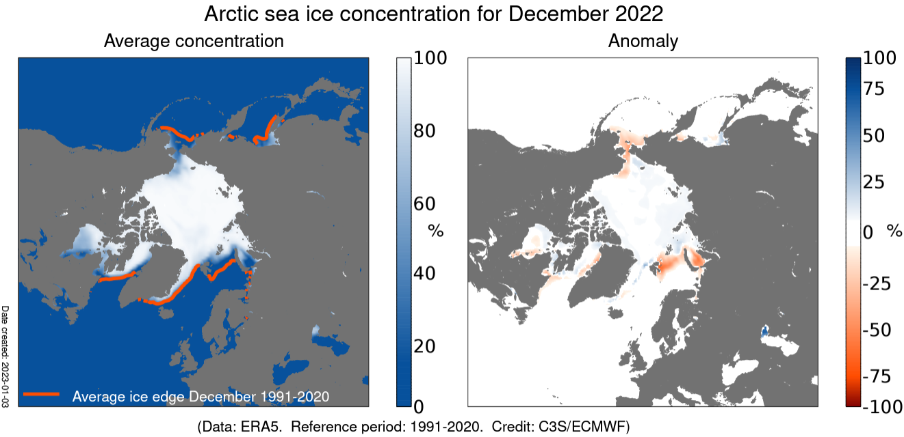
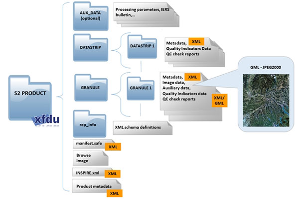

.pull-left[
## What is Sentinel-2
an Earth observation mission from the European Commission’s Copernicus Program that systematically acquires optical imagery at high spatial resolution (10m to 60m) over the land and coastal water.

### Mission
support a wide range of service such as agricultural monitoring, emergencies management, land cover classification or water quality.
]

.pull-right[

### Launch date
June 23, 2015

### Sensor
MultiSpectral Instrument (MSI)

```{r echo=FALSE, out.width='60%'}

```


.small[model of Sentinel-2. Source: [Sentinel-2](https://upload.wikimedia.org/wikipedia/commons/thumb/3/3d/Sentinel_2-IMG_5873-white_%28crop%29.jpg/413px-Sentinel_2-IMG_5873-white_%28crop%29.jpg)]
]

---

## Characteristics

[1] Spatial resolution: 10m, 20m, 60m

[2] Radiometric resolution: 12 bit, enabling the image to be acquired over a range of 0 to 4095 potential light intensity values. The radiometric accuracy is less than 5% (goal 3%)

[3] Temporal Resolution: The revisit frequency of each single Sentinel-2 satellite is 10 days and the combined constellation revisit is 5 days

[4] Spectral resolution: 13 bands in the visible, near infrared, and short wave infrared part of the spectrum

[5] Systematic global coverage from 56°N to 84°S

[6] Free and open source data for analysis

[7] 290km field of view

---

class: center, middle

```{r echo=FALSE, out.width='90%'}

```
Source: [EOS data analytics](https://eos.com/find-satellite/sentinel-2/)

---

class: center, middle

### Sepctral comparison between Sentinel-2 and Landsat8

```{r echo=FALSE}
knitr::include_graphics("image/Landsat.v.Sentinel-2.png")
```
Source: [Landsat.GSFC.NASA](https://landsat.gsfc.nasa.gov/wp-content/uploads/2015/06/Landsat.v.Sentinel-2.png)

The Landsat 8's two sensors outperform the sentinel-2 in the identification of wavelengths above 3000nm.

---

##  Application: Help Europe's maritime surveillance

1. detection of potentially suspicious vessels involved in trafficking or smuggling of goods

2. monitoring of ship-to-ship transfers

3. early warning and identification of criminal trafficking and smuggling.

```{r echo=FALSE}

```
Source: [EMSA](https://www.emsa.europa.eu/copernicus/cms-cases/item/3992-copernicus-infosheet-customs-activities-overview.html)

---

## Application: Climate change: sea ice monitoring


```{r echo=FALSE, out.width='70%'}

```
    [1981-2010](https://climate.copernicus.eu/sea-ice-cover-december-2022)
```{r echo=FALSE, out.width='70%'}

```
    [1991-2020](https://climate.copernicus.eu/sea-ice-cover-december-2022)

---
## Reflection on Sentinel-2

Sentinel-2's sensor called MSI, and it can identify 13 bands, enabling two to three visits to most inhabited areas of the world in five days, and are widely used in agricultural production, emergency management, geological surveys, hydrological monitoring, climate monitoring and anthropogenic activity monitoring management.

```{r echo=FALSE, out.width='70%'}

```

data format. Source: [The European Space Agency](https://sentinels.copernicus.eu/ar/web/sentinel/user-guides/sentinel-2-msi/data-formats)

---
## Reflection on further use for my work

* Sentinel-2 provides a very rich source of data and a standardised data structure for me to access and analyse, and covers a wide range of topics

* The visualisation of the data allows me to visualise patterns and see trends, such as urban development and sea ice monitoring

* This data is still valuable for in-depth applications in many aspects such as forest management, emergency management

---

# Reference
* “Climate Change | Copernicus.” Www.copernicus.eu, www.copernicus.eu/en/copernicus-services/climate-change. Accessed 26 Jan. 2023.

* “Land | Copernicus.” Www.copernicus.eu, www.copernicus.eu/en/copernicus-services/land.

* “Sentinel-2: Satellite Imagery, Overview, and Characteristics.” Eos.com, 10 Oct. 2017, eos.com/find-satellite/sentinel-2/.

* “User Guides - Sentinel-2 MSI - Applications - Sentinel Online - Sentinel Online.” Sentinels.copernicus.eu, sentinels.copernicus.eu/ar/web/sentinel/user-guides/sentinel-2-msi/applications. Accessed 26 Jan. 2023.

* webmaster. “Copernicus Infosheet Customs Activities - Overview.” Www.emsa.europa.eu, www.emsa.europa.eu/copernicus/cms-cases/item/3992-copernicus-infosheet-customs-activities-overview.html. Accessed 26 Jan. 2023.
